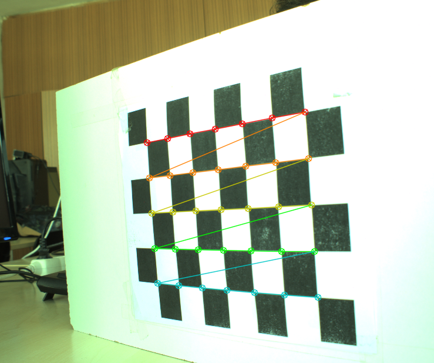
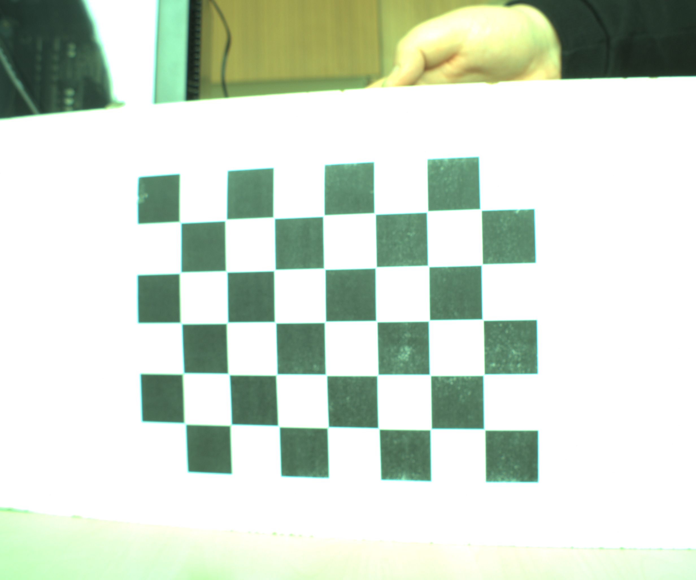
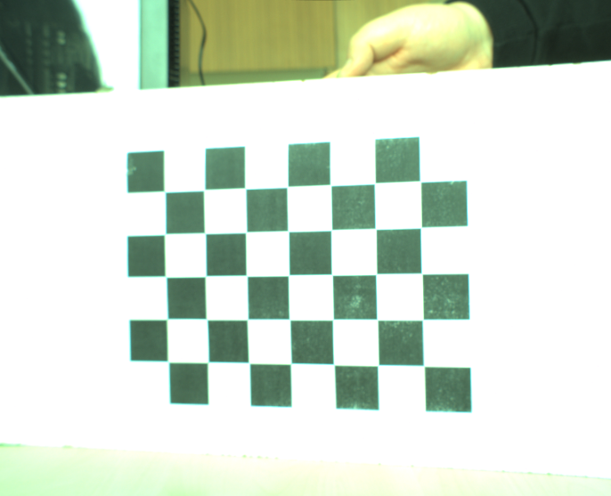
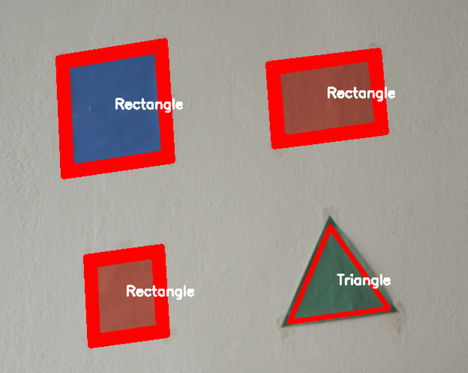
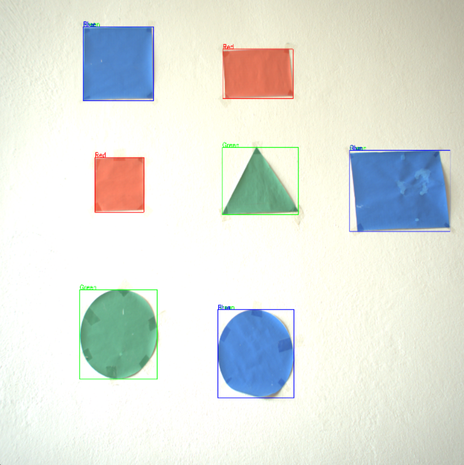
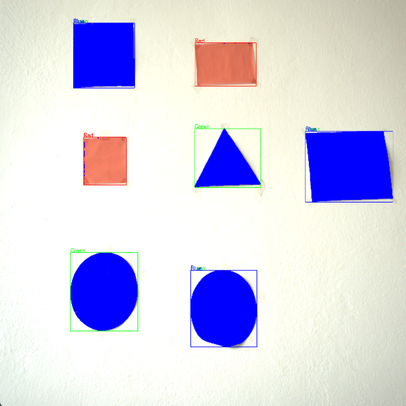

# Zadanie 2  Kalibrácia kamery a spracovanie obrazu
**Benkovsky, Medveczky**

## Úloha 1 – Kalibrácia kamery

### Postup riešenia

1. Z adresára `calibration_images/` sa načítajú všetky snímky šachovnice pomocou `glob`.
2. Každá snímka sa prevedie do odtieňov šedej (`cv2.cvtColor`).
3. Pre každú snímku sa hľadajú rohy šachovnice funkciou `cv2.findChessboardCorners` s rozmerom vzoru 7×5.
4. Ak sú rohy nájdené, spresnujú sa na subpixelovú presnosť pomocou `cv2.cornerSubPix` s kritériom konvergencie (30 iterácií, presnosť 0.001).
5. Nájdené 2D obrazové body (`imgpoints`) a zodpovedajúce 3D objektové body (`objpoints`) sa ukladajú pre každú snímku zvlášť.
6. Po spracovaní všetkých snímok sa vykoná kalibrácia kamerou funkciou `cv2.calibrateCamera`, ktorá vráti maticu vnútorných parametrov `mtx` a distorzné koeficienty `dist`.
7. Z matice `mtx` sa vypíšu hodnoty `fx`, `fy`, `cx`, `cy`.
8. Výsledky kalibrácie sa uložia do súboru `camera_calibration.npz`.
9. Na testovacej snímke sa vypočíta optimalizovaná kamera matica pomocou `cv2.getOptimalNewCameraMatrix`.
10. Snímka sa napraví (undistortion) funkciou `cv2.undistort`, oreže sa podľa ROI a uloží ako `calibresult.png`.

### Použité metódy

- **`cv2.findChessboardCorners`** – detekcia rohov šachovnice v šedoodtieňovom obraze
- **`cv2.cornerSubPix`** – spresnenie polohy rohov na subpixelovú úroveň
- **`cv2.calibrateCamera`** – výpočet vnútorných parametrov a distorzných koeficientov metódou Zhang
- **`cv2.undistort`** – odstránenie skreslenia obrazu pomocou kalibračných parametrov

### Získané parametre kamery

| Parameter | Hodnota |
|-----------|---------|
| fx | 3771.262 |
| fy | 3774.195 |
| cx | 1284.509 |
| cy | 1054.158 |

Distorzné koeficienty:

```
dist = [[-5.84792992e-01  4.06586763e+00 -2.84257356e-03 -2.08142018e-03
  -2.18791941e+01]]
```

### Ukážky výsledkov

#### Detekcia rohov šachovnice:




#### Porovnanie – originál vs. napravený obraz:**

##### Pôvodný obraz


##### Kalibrovaný obraz



## Úloha 2 – Detekcia geometrických tvarov

### Postup riešenia

1. Kamera Ximea sa inicializuje s expozíciou 50 000 µs, formátom RGB32 a automatickým vyvážením bielej.
2. V okne `Live` sú dostupné 4 trackbary: minimálna/maximálna veľkosť tvarov, veľkosť Gaussovho blurovacieho jadra a parameter `param2` pre Houghovu transformáciu.
3. Každý frame sa prevedie do odtieňov šedej a rozmaže sa Gaussovým filtrom (`GaussianBlur`) so veľkosťou jadra z trackbaru.
4. Hrany sa detegujú pomocou `cv2.Canny` s prahmi 30 a 200.
5. Na hranovom obraze sa aplikuje adaptívne prahovanie `cv2.adaptiveThreshold` a nájdu sa kontúry `cv2.findContours`.
6. Kruhy sa detegujú nezávisle pomocou `cv2.HoughCircles` (metóda `HOUGH_GRADIENT_ALT`) s parametrami z trackbarov. Každý nájdený kruh sa zakreslí a označí.
7. Pre ostatné tvary sa každá kontúra aproximuje polygónom (`cv2.approxPolyDP` s epsilon = 2 % obvodu). Počet strán určuje typ tvaru: 3 = trojuholník, 4 = obdĺžnik/štvorec, 5 = päťuholník, 6 = šesťuholník.
8. Pre štvoruholníky sa overí konvexnosť (`cv2.isContourConvex`) a pravouhlé rohy vlastnou funkciou `is_right_angle_quadrilateral` (kosínusové kritérium < 0.25).
9. Ťažisko každého tvaru sa vypočíta z momentov (`cv2.moments`) ako `x = M10/M00`, `y = M01/M00`.
10. Detegované tvary sa ukladajú do `pandas.DataFrame` s atribútmi: názov tvaru, súradnice stredu a plocha.

### Ukážky výsledkov

**Detekcia kružníc:**




## Úloha 3 – Farebný filter

### Postup riešenia

1. Kalibračné parametre (`mtx`, `dist`) sa načítajú zo súboru `camera_calibration.npz`.
2. Kamera Ximea sa inicializuje rovnako ako v predchádzajúcich úlohách.
3. Spustia sa dve okná: hlavné "Color Detection Ximea" a "Controls" s trackbarmi pre každú farbu. Trackbary umožňujú za behu prepínať režim ladenia HSV rozsahov (Tune Red/Green/Blue), zapínať/vypínať výmenu farby (Rep G/R/B) a nastaviť výstupnú BGR farbu náhrady pre každý kanál zvlášť.
4. Napravený frame sa prevedie do farebného priestoru HSV (`cv2.cvtColor`, `COLOR_BGR2HSV`), ktorý je robustnejší voči zmenám osvetlenia ako BGR.
5. Pre červenú farbu sa vytvárajú dve masky (intervaly 0–10 a 170–180 v H kanáli). Ak je zapnutý "Tune Red", hranice sa čítajú z trackbarov za behu; inak sa použijú pevné predvolené hodnoty. Rovnaký mechanizmus platí pre zelenú a modrú.
6. Pre zelenú (40–160) a modrú (94–120) farbu sa vytvorí jedna maska každá pomocou `cv2.inRange`.
7. Všetky masky sa rozšíria morfologickou dilatáciou s jadrom 5×5 (`cv2.dilate`), čím sa eliminujú malé diery.
8. Farebná výmena: pre každú farbu je možné nezávisle zapnúť náhradu prepínačom (Rep G/R/B). Výstupná farba nie je pevne daná — určuje sa trojicou BGR trackbarov ("Color→ B/G/R") nastaviteľnou za behu bez reštartu programu.
9. Pre každú farbu sa nájdu kontúry v maske, odfiltrovávajú sa plochy < 600 px² a okolo každého objektu sa nakreslí ohraničujúci obdĺžnik s farebným popisom.
10. Výsledný obraz sa zmenší na 640×640 px a zobrazí v reálnom čase.

### Použité metódy

- **HSV farebný priestor** – robustnejšia detekcia farieb nezávislá od intenzity osvetlenia
- **`cv2.inRange`** – prahovanie v HSV priestore pre izoláciu farebného rozsahu
- **`cv2.dilate`** – morfologická dilatácia pre zaplnenie medzier v maske
- **`cv2.findContours` + `cv2.boundingRect`** – detekcia a ohraničenie farebných objektov
- **`cv2.undistort`** – aplikácia kalibrácie na každý frame pred spracovaním

### Ukážky výsledkov

**Detekcia farieb s ohraničujúcim obdĺžnikom:**




**Farebná výmena: zelená - modrá:**

